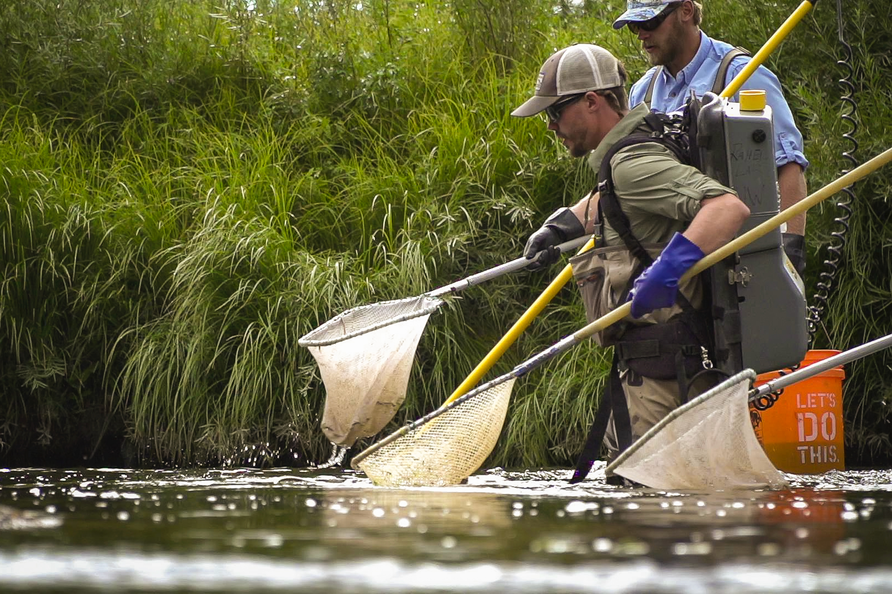

<figure>
  
  <figcaption>
  Sampling fish in the Laramie River near Laramie, WY, 2018. Photo: <a href="https://www.kspradleyphoto.com/">Kyle Spradley</a>
  </figcaption>
</figure>

I'm a quantitative ecologist with broad research interests. My primary interests are conservation biology (science and implementation at local to regional scales), community ecology (freshwater fishes, invertebrates), food web ecology (niche variation and stable isotopes) ecohydrology (environmental flows, groundwater management), and climate change (impacts and adaptation strategies). My dissertation work in the Rahel lab at the University of Wyoming centered on the environmental and biotic drivers of food web structure in streams, and postdoctoral research at UW-Madison and the Wisconsin Department of Natural Resources centered on climate change resiliency in wild trout populations. I am now an EPA Postdoctoral Fellow at the Center for Limnology at UW-Madison. 

Aside from my ecological research, I also work to increase science literacy and access through local and virtual outreach activities.  

When I'm not doing science, I'm usually reading, fishing, biking, or exploring nature with my partner and dog. 
       

Left: Brook enjoying shade after a ride. Middle: a Wisconsin trout stream. Right: My first Wisconsin fish on a fly.

 
