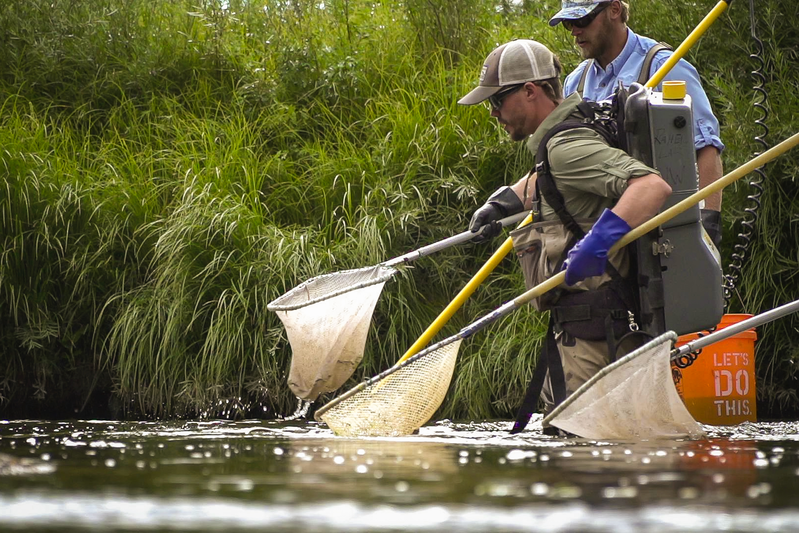

<figure>
  
  <figcaption>
  Sampling fish in the Laramie River near Laramie, WY, 2018. Photo: <a href="https://www.kspradleyphoto.com/">Kyle Spradley</a>
  </figcaption>
</figure>

Big data and rapidly improving statistical tools are enabling scientists to answer previously unanswerable questions. I use these emerging tools to quantify the mechanisms that drive how fishes and other animals interact with each other and their environments, then apply that knowledge to conservation practice. My research program integrates food web ecology, stable isotopes and physiology, statistical modeling, and conservation science to characterize how and why animals east what they eat, identify data-driven pathways for fisheries conservation, and develop new approaches for conserving fish and ecosystems. In my international work, I work to build in-country conservation capacity by partnering with regional organizations and training local graduate students to be future conservation leaders.

I grew up in urban New York City, went to SUNY: ESF in Syracuse for my undergraduate degree, received my M.Sc. degree in the Poesch Lab at the University of Alberta, my Ph.D. in the Rahel Lab at the University of Wyoming, and did postdoctoral research with the Wisconsin DNR, and in the Jensen lab at the University of Wisconsin-Madison. I am now working in the Loheide Hydroecology on a pumped storage hydropower project. When I'm not doing science, I am usually reading, fishing, biking, or exploring nature with my partner and dog.

   
 
Left: Brook enjoying shade after a ride. Middle: a Wisconsin trout stream. Right: My first Wisconsin fish on a fly.

 
